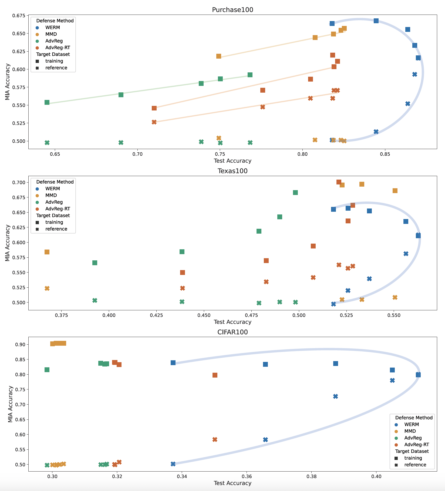
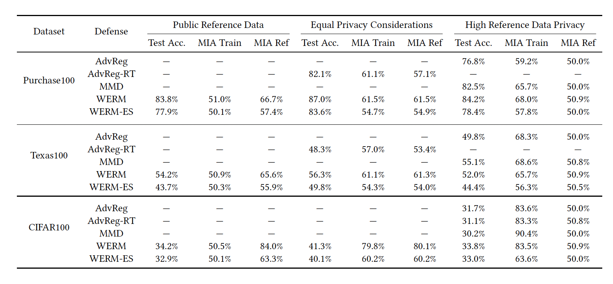
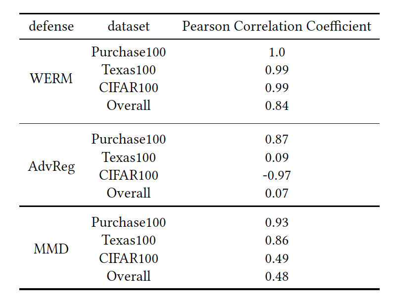
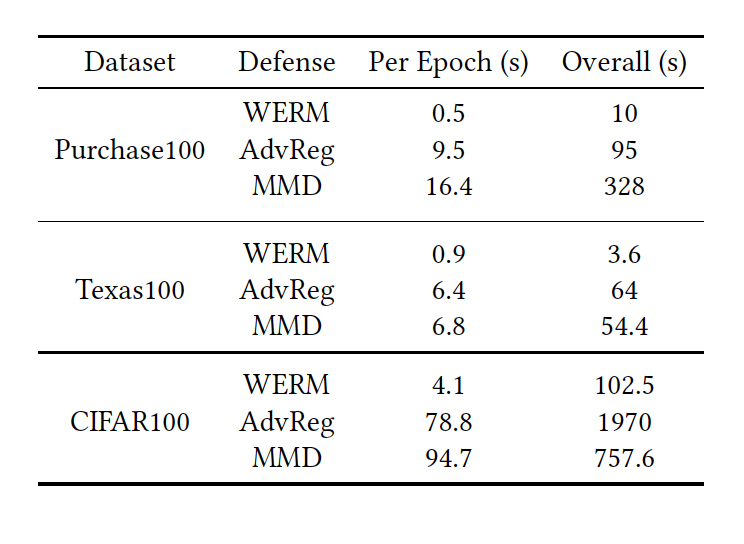

# Artifact Appendix

Paper title: A Cautionary Tale: On the Role of Reference Data in Empirical Privacy Defenses

Artifacts HotCRP Id: 77

Requested Badge: **Reproducible**

## Description
The artifact consists of a series of Jupyter notebooks that accompany our paper. These notebooks contain the code and experiments presented in the paper and demonstrate the empirical evaluations performed. Through these artifacts, readers can reproduce the findings, plots, and data analyses discussed in the paper.

### Security/Privacy Issues and Ethical Concerns
There are no ethical concerns regarding our artifacts.

## Basic Requirements

### Hardware Requirements
These experiments can be executed on any machine with NVIDIA GPUs that support CUDA 11.0 or later.

### Software Requirements
The experiments were run on a Linux-based system and the Python packages are all contained in the requirements.txt. 

### Estimated Time and Storage Consumption
Depending on the hardware used, each of the three experiment notebooks may take between 2 to 8 hours to complete and approximately 10GB of disk space is required for data and additional files.

## Environment

### Accessibility
Our artifacts are hosted in GitHub.

### Set up the environment
```bash
# Clone the repository
git clone https://github.com/ckaplan100/PETS-2024.git

# Navigate into the repository
cd PETS-2024

# Build the Docker image
docker build -t artifact_image .

# Run the Docker container with volume mount to ensure GitHub repo access
docker run -it --gpus all -v $(pwd):/workspace artifact_image

# Once inside the Docker container, navigate to the mounted workspace
cd /workspace

# Start Jupyter Notebook
jupyter notebook --ip 0.0.0.0 --allow-root
```

### Testing the Environment

## Artifact Evaluation

### Main Results and Claims

#### Main Result 1: Utility-Privacy Curves and Associated Values
Our paper presents utility-privacy curves and a table showing utility-privacy values under various training-reference data privacy settings. The experiments supporting this claim involve running each of the algorithms ten times and averaging the resulting utility and privacy scores.

#### Main Result 2: Pearson Correlation Coefficients
Our paper shows the Pearson correlation coefficients between theoretical and empirical relative privacy for each algorithm.

#### Main Result 3: Per Epoch Training Time
Our paper shows the per epoch training time for each algorithm.

### Experiments

### Experiment 1: Utility-Privacy Curves and Values (This experiment needs to be run before the others)
#### How to Execute: 
Run the following commands to run and save experiment results: 
```bash
python run_experiments.py --algorithm werm --gpu {your_gpu_number}
python run_experiments.py --algorithm mmd --gpu {your_gpu_number}
python run_experiments.py --algorithm adv_reg --gpu {your_gpu_number}
```

Afterwards, run the following command to save a figure called utility-privacy-analysis.png:
```bash
python analyze_experiments.py --evaluation utility-privacy --gpu {your_gpu_number}
```

#### Expected Result: 
The saved file will be a plot that corresponds to Figure 3 in the paper, which also includes results for WERM-ES as shown only in Table 2 and the appendix of the paper.

<p align="center">
  
  <br>
  <b>Utility-Privacy Curves (Figure 3)</b>.
</p>

<p align="center">
  
  <br>
  <b>Utility-Privacy Analysis (Table 2)</b>.
</p>

Time and Space: It will take around 10-15 hours to complete this experiment, consuming around 10GB of disk space.

Supported Claims: This experiment supports Main Result 1.

### Experiment 2: Pearson Correlation Coefficients
#### How to Execute: 
Run the following command:
```bash
python analyze_experiments.py --evaluation pcc --gpu {your_gpu_number}
```

#### Expected Result: 
You will get values corresponding to Table 6 in the paper's appendix.

<p align="center">
  
  <br>
  <b>Pearson Correlation Coefficients (Table 6)</b>.
</p>

Time and Space: This will take a few seconds and consume negligible additional disk space.

Supported Claims: This experiment supports Main Result 2.

### Experiment 3: Per Epoch Training Time

#### How to Execute: 
Run the following command:
```bash
python analyze_experiments.py --evaluation runtime --gpu {your_gpu_number}
```

#### Expected Result: 
The per-epoch training time will be printed as output and should corroborate the paper's claim regarding the relative speed of WERM compared to the other algorithms.

<p align="center">
  
  <br>
  <b>Per-Epoch Training Time (Table 4)</b>.
</p>

Time and Space: This experiment will take around 30 minutes to an hour and consume negligible additional disk space.

Supported Claims: This experiment supports Main Result 3.

## Limitations
The artifact primarily supports the reproduction of key results and figures in the paper: utility-privacy curves, Pearson correlation coefficients, and per-epoch training times. However, it is important to note that the time estimations provided are based on specific hardware configurations. Results may vary when using different hardware.

## Notes on Reusability
Our artifact can serve as a framework for benchmarking the utility-privacy tradeoff of new empirical privacy defenses that use reference data.
